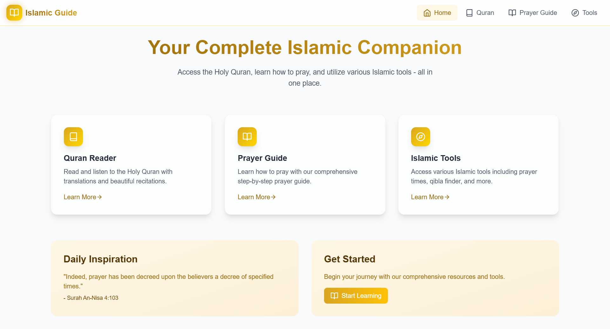

<div align="center">

# 🌟 Islamic Guide
### Your Spiritual Companion in the Digital Age

[](https://github.com/Saoud30/Islamic-Guide)
[](https://opensource.org/licenses/MIT)
[](https://reactjs.org/)

---

[📖 Features](#features) • [🎯 Demo](#demo) • [🚀 Installation](#installation) • [👥 Contributing](#contributing) • [📱 Download](#download) • [📞 Support](#support)

---

</div>

## ✨ Embark on Your Spiritual Journey

Welcome to **Islamic Guide** – where technology meets spirituality. Our platform is thoughtfully crafted to be your companion in strengthening your connection with Allah (ﷻ) through a suite of comprehensive tools and resources.

<div align="center">

### 🌙 Your Digital Sanctuary Features

</div>

<table align="center">
<tr>
<td align="center" width="33%">
<b>📖 Quran Reader</b><br>
Immerse in divine verses with crystal-clear recitations
</td>
<td align="center" width="33%">
<b>🕌 Prayer Guide</b><br>
Master your prayers with interactive guidance
</td>
<td align="center" width="33%">
<b>🧰 Islamic Tools</b><br>
Essential resources for daily worship
</td>
</tr>
</table>

## 🎯 Core Features

### 📱 Daily Essentials
- **⏰ Prayer Times:** Location-based accurate prayer timings
- **🧭 Qibla Finder:** Precise Kaaba direction anywhere
- **📅 Hijri Calendar:** Islamic dates and events tracker
- **💰 Zakat Calculator:** Simplified zakat calculations

### 📖 Knowledge Hub
- **🎯 Interactive Quran:** Read the Quran Word-by-word or full surah translations and tafsir
- **✨ Quran Listening:** listen beautiful qirat of quran word-by-word or full surah at a time
- **🌟 Hadith Collection:** Authentic hadith with references
- **📿 Dhikr Counter:** Digital tasbeeh with custom dhikr
- **📚 Dua Database:** Comprehensive collection of supplications

### 🎯 Personal Growth
- **✨ Good Deeds Tracker:** Monitor your spiritual progress
- **🌙 Fasting Calendar:** Manage your fasting schedule
- **💝 Sadaqah Log:** Track your charitable giving
- **⭐ Daily Reminders:** Custom spiritual notifications

## 💫 Experience the Magic

<div align="center">

### ✨ Discover Our Beautiful Interface

<div align="center">
  
</div>
<div align="center">
  
</div>
<div align="center">
  
</div>
</div>

## 🚀 Quick Start

```bash
# Clone the spiritual journey
git clone https://github.com/Saoud30/islamic-guide.git

# Install blessings (dependencies)
npm install

# Begin your journey
npm start
```

## 🛠️ Built With Divine Care

- ⚡ **React.js** - For a seamless user experience
- 🎨 **Tailwind CSS** - Beautiful, responsive design
- 📱 **React Native** - Mobile app excellence
- ⚙️ **Node.js** - Powerful backend services

## 👥 Join Our Community

Your contributions make our ummah stronger! Here's how you can help:

1. 🍴 Fork the repository
2. 🌿 Create your feature branch (`git checkout -b feature/AmazingFeature`)
3. 💫 Commit your changes (`git commit -m 'Add AmazingFeature'`)
4. 📤 Push to the branch (`git push origin feature/AmazingFeature`)
5. 🎁 Open a Pull Request

## 📞 Connect With Us

<div align="center">

[](https://twitter.com/Shazyansar/)
[](https://instagram.com/mohd._saoud/)

</div>

## 📃 License

Distributed under the MIT License. See `LICENSE` for more information.

---

<div align="center">

### 🤲 May Allah Guide Us All

*"Whoever follows a path in pursuit of knowledge, Allah makes easy for them a path to Paradise." - Prophet Muhammad ﷺ*

</div>